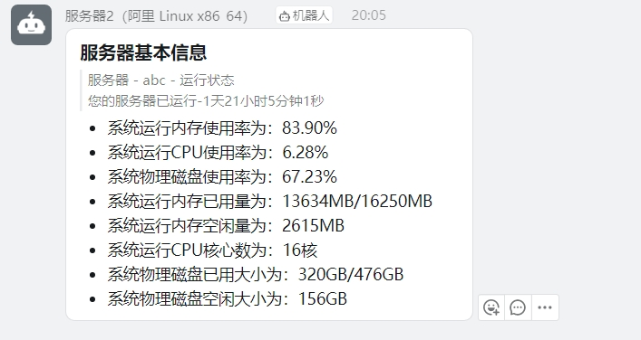

<div align=center>

<h2>回声</h2>
</div>

### 一、功能简述
- 轻量级服务器状态播报、服务器状态获取探针、服务器自动监控告警工具。
- 一切信息完全由启动参数控制，如需重新更改模式，必须关闭进程之后重新使用新的参数启动。

### 二、部署方式
- 编译部署后运行
    ```
    如果没有对应平台的包的话，可以直接自己用代码编译一下二进制可执行程序，本程序不依赖于CGO库，直接build之后运行即可
    ```
- 直接运行二进制可执行程序或创建系统守护进程运行程序
    ```
    如果需要创建Linux系统守护进程的话，可以先进入/etc/systemd/system文件夹下，新建一个echoes.service文件，并写入下面内容：

    [Unit]
    Description=Echoes service

    [Service]
    Type=forking
    ExecStart=/bin/bash -c "{你的回声程序所在路径} [启动参数] &"
    KillMode=process
    Restart=on-failure
    RestartSec=3s

    [Install]
    WantedBy=multi-user.target

    之后执行systemctl start echoes即可
    ```

### 三、使用教程
- 启动参数
    ```
    参数名称                     含义
    -help                       是否帮助模式（0/1）
    -server_name                服务器名称
    -daily_time                 每天自动通知的时间（24小时制）
    -interval_time              每次自检的时间间隔（秒）
    -loadavg_max_percent        负载率告警阈值最（百分比）
    -mem_used_percent           内存告警阈值（百分比）
    -cpu_used_percent           CPU使用率告警阈值（百分比）
    -pin_enable                 探针模式是否开启（1/0）
    -port                       主动服务的端口
    -notice_mod                 通知方式（dingbot/mail）
    -token                      通知方式的token
    -secret0                    通知方式的secret
    ```
- 参数默认值
    ```
    参数名称                     默认值
    -help                       0
    -server_name                echoes_server_{启动时间}
    -daily_time                 09:30
    -interval_time              30
    -loadavg_max_percent        70
    -mem_used_percent           90
    -cpu_used_percent           90
    -pin_enable                 1
    -port                       9966
    -notice_mod                 
    -token                
    -secret0                
    ```
- 注意
    ```
    若启动时未开启探针模式也未指定通知模式，则程序会直接退出
    若启用帮助模式，则作用仅限为查看帮助，程序会直接退出
    ```

- 演示参数
    ```
    ./echoes -server_name=echoes_server -daily_time=09:30 -interval_time=30 -loadavg_max_percent=70 -mem_used_percent=90 -cpu_used_percent=90 -pin_enable=1 -port=9966 -notice_mod=dingbot -token=xxxx -secret0=xxxx
    ```

- 通知形式
    

### 四、接口文档
1. PING - /ping
    - 说明：检查服务器监控是否存活
    - 请求方式：任意
    - 返回示例：
        ```json
        {
            "code": 0,
            "msg": "pong"
        }
        ```
2. 服务器信息 - /info
    - 说明：获取当前服务器信息
    - 请求方式：任意
    - 返回示例：
        ```json
        {
        "code": 0,
        "data": {
            "disk": {
            "path": "/",
            "fstype": "xfs",
            "total": 53660876800,
            "free": 42608521216,
            "used": 11052355584,
            "usedPercent": 20.596673485588664,
            "inodesTotal": 26214400,
            "inodesUsed": 385915,
            "inodesFree": 25828485,
            "inodesUsedPercent": 1.4721488952636719
            },
            "system": {
            "MemAll": 3743,
            "MemFree": 2086,
            "MemUsed": 1657,
            "MemUsedPercent": 44.27110833773341,
            "Days": 31,
            "Hours": 13,
            "Minutes": 57,
            "Seconds": 55,
            "CpuUsedPercent": 15.000000020372681,
            "OS": "linux",
            "Arch": "386",
            "CpuCores": 2
            }
        },
        "msg": "success"
        }
        ```

### 五、专注的点
- 全平台设备探针和告警支持。
- 无需安装任何依赖，直接运行即可。
- 运行后无需任何操作，自动监控服务器状态。
- 探针、告警、通知一体，简单部署即可使用。

### 六、开发进度
- [X] 检查服务器是否存活（PING）
- [X] 内存使用情况监控/告警
- [X] CUP使用情况监控/告警
- [X] 硬盘使用情况监控
- [X] 操作系统信息获取
- [X] 负载率过高告警
- [X] 作为探针主动获得服务器状态
- [X] 钉钉机器人群通知
- [ ] 邮箱通知
### 七、历史版本
- https://github.com/tyza66/ServerWatcher-DingBot
- https://github.com/tyza66/ServerWatcher-DingBot-Go